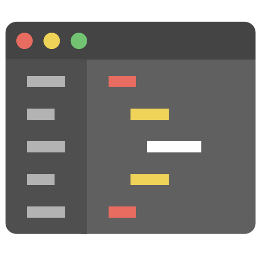

# micro-code-editor
- Micro Code editor is A Syntax highlighter that can run online or offline.

  

---
### 🔗 Link: https://rededge967.github.io/micro-code-editor
---
## Preview

---
## Running `Micro Code Editor`
### Running `online`
- Open up your browser
- Go to https://rededge967.github.io/micro-code-editor
### Running `offline`
- Go to the [releases](https://github.com/RedEdge967/micro-code-editor/releases) and download it
- Extract the folder
- Run `index.html` file in your browser
---
## Can I contribute?
- Sure, open an issue, point out errors, and what not. Wanna fix something yourselves, you're welcome to open a pull request and I appreciate it.
---
### Browser Support
 |  |  |  | 
--- | --- | --- | --- | --- |
Latest ✔ | Latest ✔ | Latest ✔ | Latest ✔ | Latest ✔ |
---
> ### If you found this FOSS as a useful software, don't forget to give a star and fork to make a upgraded version of Micro code editor with adding your own features.
